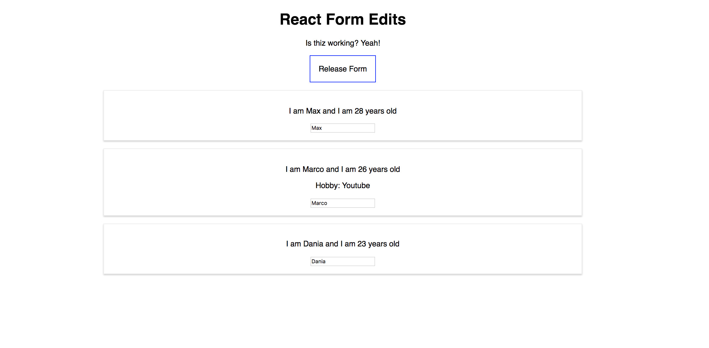

# React Form



This repo was an experiment to create a simple interactive form in order to understand the React basics such as components, props, children and others.

# How to Use

1. Clone the Project to your local desktop
```
git clone https://github.com/thatdania/reactForm.git
```

2. Change into the project directory
```
cd reactForm
```

3. Install all devDependencies
```
npm install
```

4. Load it up
```
npm start
```

Be impressed by the simple things react can do! WHOA!
